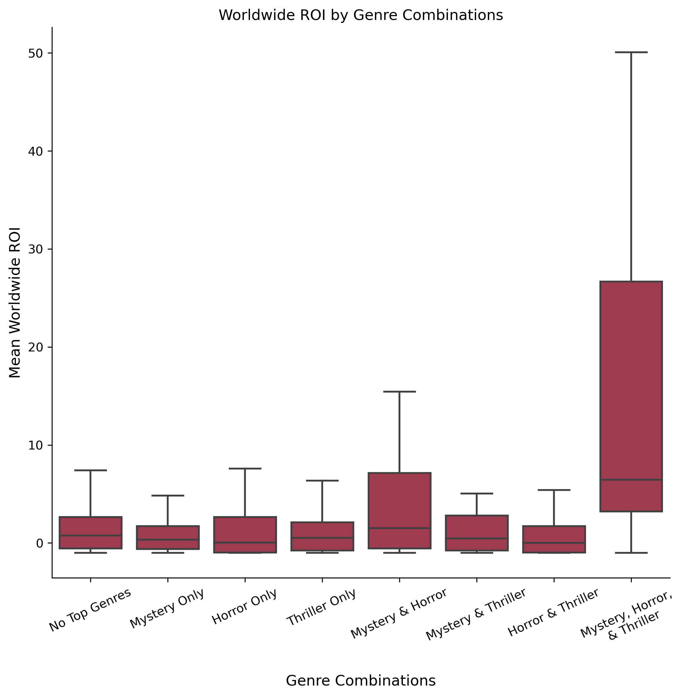
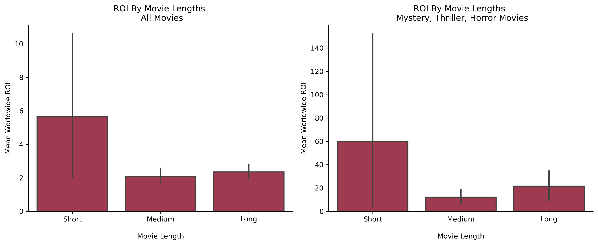

<div align="center">
  <h1>An Exploratory Data Analysis to Maximize ROI in the Film Industry</h1>
</div>

## Business Problem
In the dynamic landscape of the film industry, identifying key factors that contribute to a movie's success is paramount. This exploratory data analysis uncovers patterns and insights that can inform strategic decision-making. Our objective was to unearth the genre, runtime, release month, and creative talents that collectively yield the highest return on investment (ROI) for movies. By doing so, we equip filmmakers, producers, and investors with actionable recommendations to maximize the financial potential of their projects.

## Dataset & Methods
For this analysis, we used a [dataset scraped from IMDB](https://www.imdb.com/) with information on 73,856 movies. We extracted information on genre, runtime, release date, and IMDB rating for each movie, and saved them in a structured CSV file available in this repository. We combined this dataset with another containing [financial information on 5,782 movies scraped from The Numbers](https://www.the-numbers.com/). From this merger, we identified 2,178 unique movies shared between the two datasets, which became our analytical focus. Using a series of data visualizations, we explored the data to uncover trends that contribute to movies returning large return on investments (ROI). This process allowed us to identify patterns and provide recommendations for maximizing ROI in the film industry.

## Results
Our analysis reveals compelling insights that shed light on key determinants of a movie's financial success. Below we outline the pivotal findings.

### Genre:
We begin with an exploration of which genre provides the best returns.

<p align="center">

</p>

We observe that movies belonging to the Mystery, Horror, and Thriller genres exhibit the highest mean ROIs. Given that a single movie can be associated with multiple genres, and considering the frequent overlap among our top three genres, we aimed to determine if specific combinations of these genres (e.g., a movie being both a Mystery and a Horror, or both a Horror and a Thriller) result in even higher ROIs. Next, we introduce a new column that identifies which of the top three genres (if any) the movie falls under and plot ROI for each genre combination.

<p align="center">

</p>

When considering individual genres, Mystery stands out with the highest ROI at 7.37. However, our follow-up analysis into genre combinations reveals an even more compelling insight: movies that encompass all three – Mystery, Horror, and Thriller – boast a mean ROI of 27.86.

The above boxplot shows that Mystery+Horror+Thriller movie have a median ROI that surpasses the the 75th percentile of all other genre combinations, indicating that these movies typically perform better than others. The boxplot additionally shows large variability in ROI for Mystery+Horror+Thriller movies, hinting at the potential for massive returns. Going forward, we will focus on movies that are categorized under the Mystery, Horror, and Thriller genres.

### Runtime: 
We next turn our attention to another potentially important aspect of movies: their runtime. We specifically analyze how the length of a movie, categorized as short, medium, or long, influences its ROI.
<p align="center">

</p>

Short movies outperform their longer counterparts in terms of ROI. This trend holds true across all movies for Mystery+Horror+Thriller movies. Though the shapes of the two above graphs are similar, the y axes are remarkably different from one another, with the ROI for short movies having a mean of 6 amongst all movies and a mean of 60 for Mystery+Horror+Thriller movies. The strategic choice is to focus on shorter Mystery+Horror+Thriller movies for optimal returns.

### Annual Trends:
We next consider how a movie's month of release can shape its financial trajectory. Movies tend to perform well in the summertime, but since we are focused on scary movies, we might see better results around Halloween. We plot ROI across months for all movies and for Mystery+Horror+Thriller movies to determine which release month will yield the best results.

<p align="center">

</p>

Contrary to our initial hunch, July outperforms all other months in terms of ROI both for all movies and for Mystery+Thriller+Horror movies. Mystery+Thriller+Horror movies have a slight increase in ROI in October, but it is insignificant when compared to the much larger increase seen in the heart of summer. Of note, July releases show more variability in ROI as compared to other months, again pointing to the possibility of a much higher return than would typically be expected.

Writers and directors can make or break a movie, so we next sought out industry mavens with a track record of producing Mystery+Thriller+Horror films with high ROIs.

### Directors & Writers: 
We filter for writers and directors who have been involved in 3 or more movies and have an average ROI greater than 10.

<p align="center">

</p>

James Wan is our top recommendation for director, as he has 4 movies in our dataset, two of which are Mystery+Thriller+Horror movies and with an average ROI of 23.4. We have two alternative suggestions (Christopher Landon and Pierre Coffin) who also have 4 movies each within our dataset with an ROI of 11.84 and 11.45, respectively.

<p align="center">

</p>

Oren Peli is our top recommendation for writer, as he has 7 movies in our dataset, averaging an ROI of 27.22, and all of his movies have at least one of the top three genres.

Christopher Landon is a close second, as he also has 6 movies in our dataset, averaging an ROI of 24.9, and all of his movies also have at least one of the top three genres.

We have two alternative suggestions (James DeMonaco and Damien Chazelle) who each have 4 movies within our dataset with an ROI of 15.29 and 14.29, respectively.¶

## Recommendations
Drawing from our analysis of movie trends and performance metrics, we created a movie blueprint that geared towards the objective of maximizing returns on investment:
* Develop a narrative that blends Mystery, Horror, and Thriller. This combination of genres have the unique trait of being able to yield high financial returns on relatively small budgets. 
* Keep the movie brief (around 75 minutes), as shorter movies are more cost-effective, and therefore, have higher ROIs.
* Release the movie in July. Contrary to the conventional wisdom of releasing horror films around Halloween, our analysis found July is the optimal time to release the movie.
* Recruit James Wan, Christopher Landon, or Pierre Coffin to direct the movie. These directors have a proven track-record of creating films with high ROI.
* Recruit Oren Peli, Christopher Landon, James DeMonaco, or Damien Chazelle to write the movie. These writers have have consistently demonstrated their ability to write narratives that drive impressive financial returns.
Our analysis indicate that combining these four recommendations will maximize the chance that each dollar spent on the movie will yield a high return on investment. This blueprint offers a strategic path forward in the competitive world of film and provides a tailored strategy to turn a movie idea into a financial success.

## Repository Structure
```none            
├── data 
├── imgs                   
├── .gitignore
├── README.md 
├── movie-analysis-eda.ipynb
└── pres-movie-analysis-eda.pdf
